# Ausgangslage

Als Organisator der Velobörse in Gossau, möchte ich gewisse Prozesse digitalisieren um so den Kunden Zeit zu ersparen. Konkret möchte ich die Veloabgabe so vereinfachen, dass die Kunden bereits im Voraus alle Daten Ihres Velos erfassen können und somit nur noch das Velo hinstellen müssen, statt darauf zu warten bis jemand Zeit hat das Velo zu erfassen. 
Zurzeit wird dieses Problem mit einem PDF-Dokument gelöst, welches per Email zugesendet werden muss, doch dies scheint der Community zu aufwendig zu sein, somit möchte ich das neu mit einer Webapplikation lösen.

# Projektidee

Mein Ziel ist es eine grafische, der Webseite angepasste, Lösung zu schaffen, welche den Kunden ermöglicht direkt alle Angaben online zu erfassen. Für die Eingabe wird ein Benutzerkonto verwendet, der User muss sich somit registrieren. Die Eingabe soll über eine Art Formular laufen und für jedes erfasste Fahrrad soll ein Namen vergeben werden, damit beim Verkauf nichts falsch läuft. Die gesamte Lösung ist vorallem für Kunden angedacht, welche mehrere Velos zum Verkauf anbieten möchten. Des Weiteren soll am Ende eine Art Quittung generiert werden, wo alle erfassten Fahrräder aufgelistet werden.

# Qualität und Originalität der Anwendung

Die Qualität der Anwendung liegt vorallem darin, dass ein zurzeit sehr aufwendiger Prozess stark vereinfacht werden kann.
Zudem ist die digitale Erfassung gegenüber der Erfassung auf Papier sinnvoller, da später aus den erfassten Daten Trends erkennt werden können.
Die Originalität ist vorallem darin zu sehen, dass die Anwendung zu einem späteren Zeitpunkt vollständig auf der Webseite integriert werden kann und so von rund 2000 Kunden genutzt wird. Ein weiterer Vorteil besteht in der Skalierbarkeit dieser Anwendung, da es in der Schweiz rund 200 Velobörsen gibt, welche alle von dieser Innovation profitieren können.

# Pain Points
- Erstellung des Formulars, sodass Informationen an Datenbank übertragen werden
- Speichern der eingegeben Daten in einer Textdatei
- Abrufen der Daten aus einer Textdatei
- korrekte grafische Darstellung der Daten
- variable Berechnung der Zuschläge

# Funktionsbeschreibung und Walkthrough
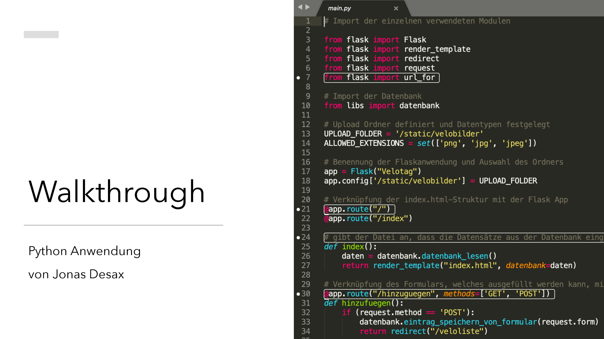
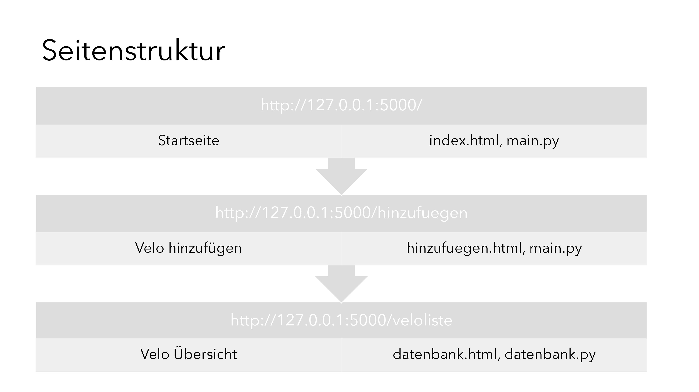
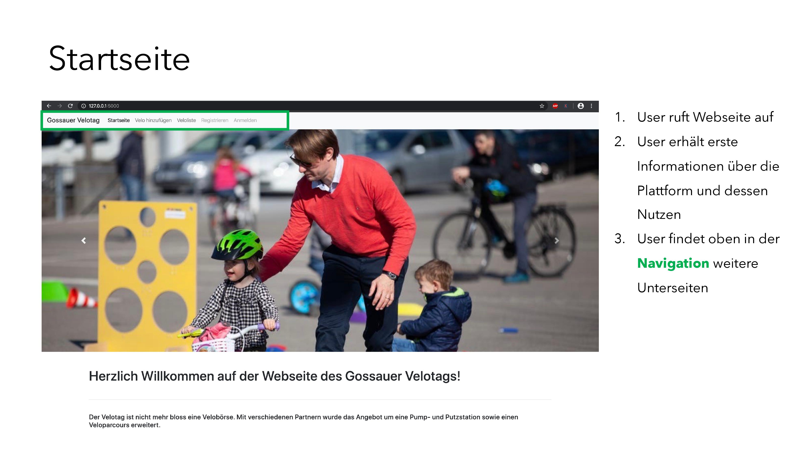
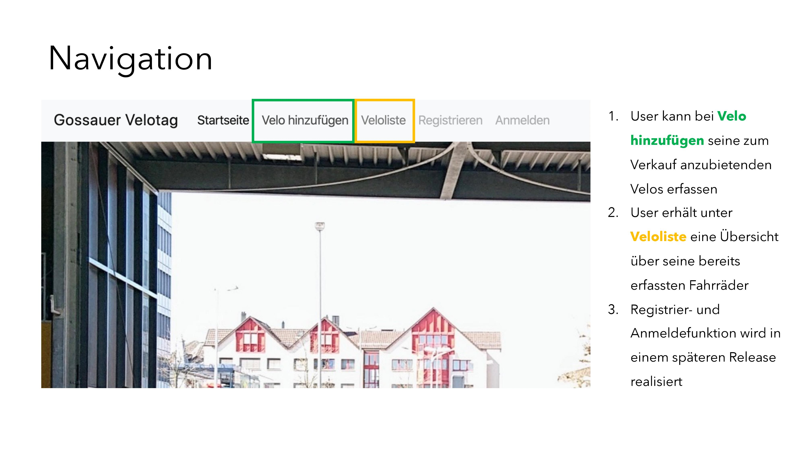
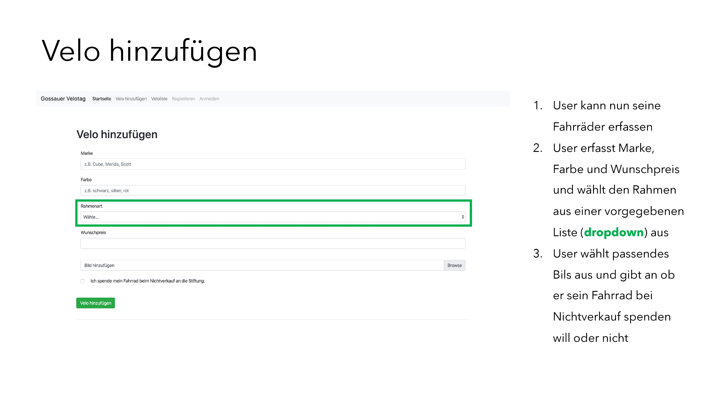
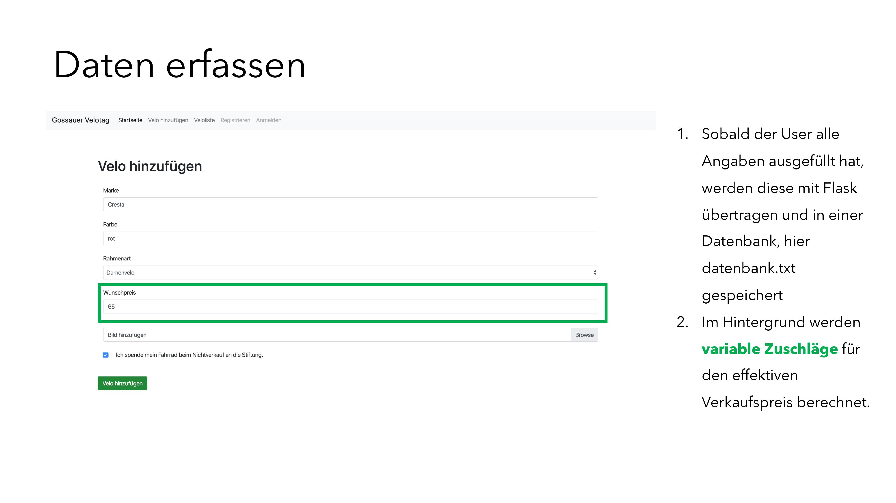
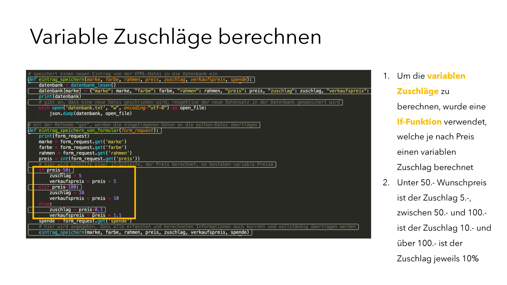
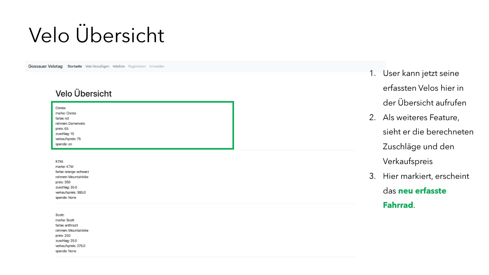
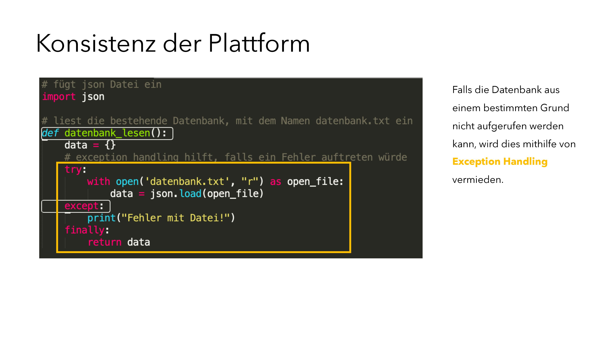
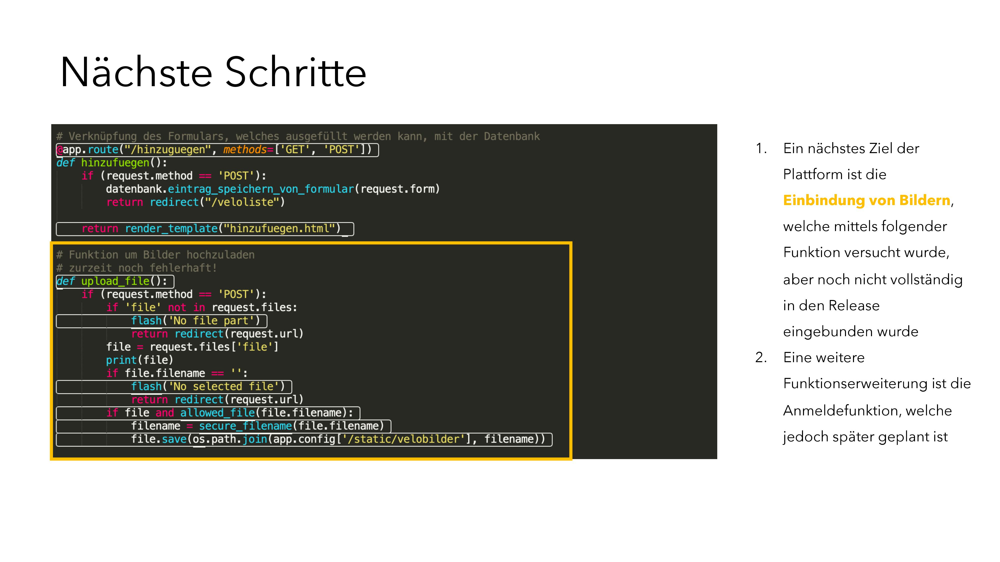

# Flowchart 1.1
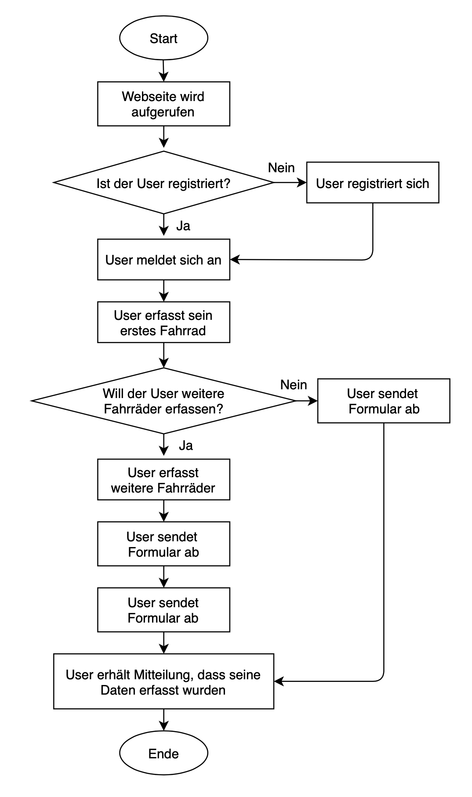

# nächste Schritte
- Einbindung von Bildern so optimieren, dass Bilder zu den jeweiligen Produkten erscheinen
- Anmelde- und Registrierfunktion umsetzen, sodass sie verschlüsselt und sicher ist
- Testing der Plattform, sodass Fehler in der Usability festgestellt und optimiert werden können